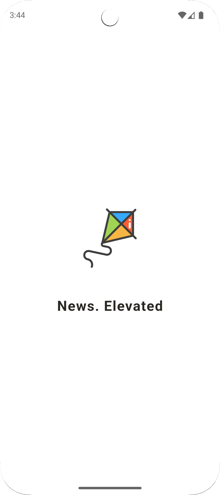

# Kagi News

A Flutter news aggregator application that displays news as aggregated by Kagi's Kite news app. The application features category-based news feeds, article summaries, historical "On This Day" events, and offers a smooth, native mobile experience with both light and dark themes.

## Features

- **Category-based News Feeds:** Navigate through different news categories via tabs
- **Historical Events View:** Special "On This Day" section showing historical events
- **News Cluster Details:** Tap on a news item to view comprehensive details including:
    - Summary
    - Key points
    - Different perspectives
    - Notable quotes
    - Historical background
    - Related articles
- **Native Mobile Features:**
    - Pull-to-refresh for latest content
    - Custom animations and transitions
    - Native splash screen
    - Fixed position close button in detail view
    - Adaptive light/dark theme
- **Background Syncing:** Keeps news content fresh with periodic background updates (every 4 hours)
- **Offline Support:** Access previously loaded news while offline

## Screenshots

<table>
    <tr>
        <td></td>
        <td></td>
        <td></td>
    </tr>
</table>

## Getting Started

### Prerequisites

- Flutter 3.29.2
- Dart 3.7.2
- Android Studio Ladybug / VS Code with Flutter extensions
- iOS development tools (for iOS builds)

### Installation

1. Clone the repository:
     ```bash
     git clone https://github.com/shafayathossain/kagi_news_flutter.git
     ```
2. Navigate to the project directory:
     ```bash
     cd kagi_news_flutter
     ```
3. Install dependencies:
     ```bash
     flutter pub get
     ```
4. Run the build runner to generate necessary files:
     ```bash
     flutter pub run build_runner build --delete-conflicting-outputs
     ```
5. Run the app:
     ```bash
     flutter run
     ```

## Project Structure

### Architecture

The app follows a clean architecture approach with:

- **Repository Pattern:** Uses data sources (API and local storage)
- **Dependency Injection:** Uses Kiwi for service location and dependency management
- **Controller Pattern:** Manages UI state and UI business logic
- **Value Notifiers:** For reactive UI updates and state management

### Technologies Used

- **Flutter:** UI framework
- **Kiwi:** Lightweight dependency injection
- **go_router:** Navigation and routing
- **shared_preferences:** Simple data persistence
- **sqflite:** SQLite database for caching news
- **background_fetch:** Background sync operations
- **flutter_native_splash:** Native splash screen implementation
- **flutter_html:** HTML content rendering
- **intl:** Internationalization and date formatting
- **url_launcher:** Opening links in browser
- **mockito:** Mocking for tests

## Testing

The project includes several tests:

- Unit Tests: Testing individual components
- Integration Tests: Testing component interactions
- Repository Tests: Testing data layer functionality

Run tests with:
```bash
flutter test
```

## Key Implementation Details

### Background Fetching
The app uses background_fetch to periodically sync data every 4 hours, ensuring fresh content is always available when the user opens the app.

### Splash Screen
The app implements a native splash screen that transitions smoothly into the in-app UI, providing a seamless loading experience.

### Data Management
The app implements a repository pattern with:
- API calls for fresh data
- Local caching for offline support and performance
- Automatic synchronization

### User Experience
- Pull-to-refresh on all screens
- Smooth animations and transitions
- Proper error handling with user-friendly messages
- Fixed-position close button in detail views
- Adaptive design for both phones and tablets

## Acknowledgements

- Kagi for the Kite news API
- Flutter and Dart teams for the amazing framework
- All the package authors whose work made this app possible
- [Kagi](https://kagi.com) for the Kite news API
- Flutter and Dart teams for the amazing framework
- All the package authors whose work made this app possible
- <a href="https://www.flaticon.com/free-icons/kite" title="kite icons">Kite icon created by Freepik - Flaticon</a>

## Contributing

We welcome contributions to improve Kagi News!

### How to Contribute

1. Fork the repository
2. Create your feature branch:
    ```bash
    git checkout -b feature/amazing-feature
    ```
3. Commit your changes:
    ```bash
    git commit -m 'Add some amazing feature'
    ```
4. Push to the branch:
    ```bash
    git push origin feature/amazing-feature
    ```
5. Open a Pull Request

### Code Style

- Follow the [Dart style guide](https://dart.dev/guides/language/effective-dart/style)
- Run `flutter analyze` before submitting PRs
- Maintain test coverage for new features

### Reporting Issues

Please use the GitHub issues tracker to report bugs or suggest features.

When reporting bugs, include:
- Your Flutter and Dart version
- Steps to reproduce the issue
- Expected and actual behavior
- Screenshots if applicable
---
Built with ❤️ using Flutter